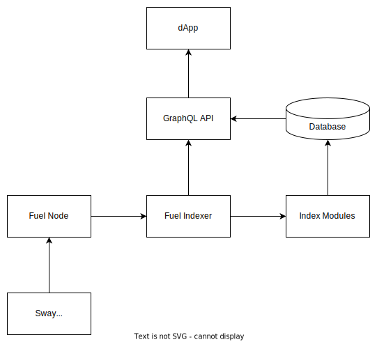

# Getting Started

This section provides an outline regarding how to get started using the Fuel indexer service, including dependency installation, basic usage, and examples.

- [Installing Rust](./installing-rust.md)
- [System dependencies](./system-dependencies.md)
- [Application dependencies](./application-dependencies.md)
- [Indexer Configuration](./configuration.md)
- [Project Structure](./fuel-indexer-project.md)

After you've installed all required dependencies. Feel free to checkout a few examples.

- [Examples](./../examples/index.md)
  - [Hello World](./../examples/hello-world.md)
  - [Block Explorer](./../examples/block-explorer.md)

## Architecture

The Fuel indexer is meant to run alongside a Fuel node and a database. Generally, the typical flow of information through the indexer is as follows:

1. A Sway smart contract emits receipts during its execution on the Fuel node.
2. Blocks, transactions, and receipts from the node are monitored by the Fuel indexer service and checked for specific user-defined event types.
3. When a specific event type is found, the indexer executes the corresponding handler from an index module.
4. The handler processes the event and stores the index information in the database.
5. A dApp queries for blockchain data by using the indexer's GraphQL API endpoint, which fetches the desired information from the corresponding index in the database and returns it to the user.
