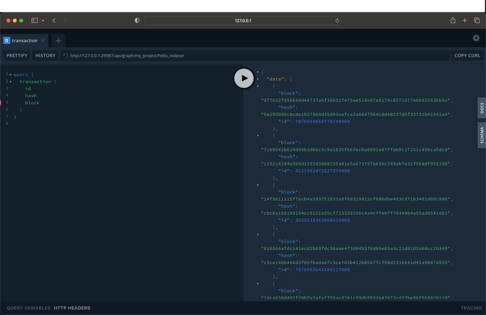

<!-- markdownlint-capture -->
# Quickstart

In this tutorial you will:

1. Bootstrap your development environment.
2. Create, build, and deploy an indexer to an indexer service hooked up to Fuel's `beta-3` testnet.
3. Query your newly created index for data using GraphQL.

## 1. Prerequisites

In this Quickstart, we'll use Fuel's toolchain manager [`fuelup`](https://github.com/FuelLabs/fuelup) in order to install the `forc-index` component that we'll use to develop our indexer. There are a lot of prerequisites so please read through each installation carefully.  

1. [Install the Rust toolchain](https://www.rust-lang.org/tools/install).

2. [Install PostgreSQL](https://www.postgresql.org/docs/).

Note: macOS you can install the latest version of PostgreSQL through `brew` by simply running:

<!-- markdownlint-disable MD014 -->
```console
$ brew install postgresql
```
<!-- markdownlint-restore -->

3. [Install the Fuel toolchain](https://github.com/FuelLabs/fuelup).

Make sure you have the latest version of `fuelup` by running the following command:

Note: older versions of `fuel-indexer` might not work in this guide

<!-- markdownlint-disable MD014 -->
```console
$ fuelup self update
```
<!-- markdownlint-restore -->

You can check your current toolchain anytime by running `fuelup show`.

> Having problems with this part? Post your question on our forum [https://forum.fuel.network/](https://forum.fuel.network/). To help you as efficiently as possible, include the output of this command in your post: `fuelup show.`

4. WebAssembly (WASM) Setup

Indexers are typically compiled to WASM so you'll need to have the proper WASM compilation target available on your system. You can install this target using `rustup`:

<!-- markdownlint-disable MD014 -->
```console
$ rustup target add wasm32-unknown-unknown
```
<!-- markdownlint-restore -->

Additionally, you'll need the `wasm-snip` utility in order to remove errant symbols from your compiled WASM binary. You can install this tool using `cargo`:

<!-- markdownlint-disable MD014 -->
```console
$ cargo install wasm-snip
```
<!-- markdownlint-restore -->

5. Install LLVM and set environment variables (For macOS users)

Users on Apple Silicon macOS systems may experience trouble when trying to build WASM modules due to its `clang` binary not supporting WASM targets. 

<!-- markdownlint-disable MD014 -->
```console
$ brew install llvm
```
<!-- markdownlint-restore -->

Open up your `.zshrc` or `.bashrc` file and add the following environment variables to the end of that file. 

<!-- markdownlint-disable MD014 -->
```console
$ nano ~/.zshrc
```
<!-- markdownlint-restore -->

```console
export AR=/opt/homebrew/opt/llvm/bin/llvm-ar
export CC=/opt/homebrew/opt/llvm/bin/clang
export LIBCLANG_PATH="/opt/homebrew/opt/llvm/lib"
export LDFLAGS="-L/opt/homebrew/opt/llvm/lib"
export CPPFLAGS="-I/opt/homebrew/opt/llvm/include"
```

Save and close the file by pressing `Ctrl+O` followed by `Ctrl+X`

Apply the changes without opening a new terminal by running:

<!-- markdownlint-disable MD014 -->
```console
$ source ~/.zshrc
```
<!-- markdownlint-restore -->

## 2. Using the `forc-index` plugin

The primary means of interfacing with the Fuel indexer for indexer development is the [`forc-index` CLI tool](https://crates.io/crates/forc-index). `forc-index` is a [`forc`](https://github.com/FuelLabs/sway/tree/master/forc) plugin specifically created to interface with the Fuel indexer service. Since we already installed `fuelup` in a previous step <sup>[1.1](#11-install-fuelup)</sup>, we should be able to check that our `forc-index` binary was successfully installed and added to our `PATH`.

```console
$ which forc-index

/Users/me/.fuelup/bin/forc-index
```

> IMPORTANT: `fuelup` will install several binaries from the Fuel ecosystem and add them into your `PATH`, including the `fuel-indexer` binary. The `fuel-indexer` binary is the primary binary that users can use to spin up a Fuel indexer service.

```console
$ which fuel-indexer

/Users/me/.fuelup/bin/fuel-indexer
```

### Check for components

Once the `forc-index` plugin is installed, let's go ahead and see what indexer components we have installed. Note that the `fuel-indexer service` status is down but we  will start that in the next step!

> Many of these components are required for development work (e.g., `fuel-core`, `psql`) but some are even required for non-development usage as well (e.g., `wasm-snip`, `fuelup`).

```console
$ forc index check

+--------+------------------------+---------------------------------------------------------+
| Status |       Component        |                         Details                         |
+--------+------------------------+---------------------------------------------------------+
|   ✅   | fuel-indexer binary    |  /Users/fuel-env/.fuelup/bin/fuel-indexer               |
+--------+------------------------+---------------------------------------------------------+
|   ⛔️   | fuel-indexer service   |  Failed to detect service at Port(29987).               |
+--------+------------------------+---------------------------------------------------------+
|   ✅   | psql                   |  /opt/homebrew/bin/psql                                 |
+--------+------------------------+---------------------------------------------------------+
|   ✅   | fuel-core              |  /Users/fuel-env/.fuelup/bin/fuel-core                  |
+--------+------------------------+---------------------------------------------------------+
|   ✅   | docker                 |  /usr/local/bin/docker                                  |
+--------+------------------------+---------------------------------------------------------+
|   ✅   | fuelup                 |  /Users/fuel-env/.fuelup/bin/fuelup                     |
+--------+------------------------+---------------------------------------------------------+
|   ✅   | wasm-snip              |  /Users/fuel-env/.cargo/bin/wasm-snip                   |
+--------+------------------------+---------------------------------------------------------+
|   ⛔️   | forc-postgres          |  Can't locate forc-postgres.                            |
+--------+------------------------+---------------------------------------------------------+
|   ✅   | rustc                  |  /Users/fuel-env/.cargo/bin/rustc                       |
+--------+------------------------+---------------------------------------------------------+
|   ✅   | forc-wallet            |  /Users/fuel-env/.fuelup/bin/forc-wallet                |
+--------+------------------------+---------------------------------------------------------+
```

### 2.2 Setup a Database and Start the Indexer Service

To quickly setup and bootstrap the PostgreSQL database that we'll need, we'll use `forc index`.

We can quickly create a bootstrapped database and start the Fuel indexer service by running the following command:

> IMPORTANT: Ensure that any local PostgreSQL instance that is running on port `5432` is stopped. 

You should see output indicating the successful creation of a database and start of the indexer service.

```console
$ forc index start --embedded-database --fuel-node-host beta-3.fuel.network --fuel-node-port 80 --run-migrations

✅ Successfully started the indexer service at PID 18235
▪▪▪▪▪ ⏱  Setting up database...
                                                                                                                                                                                                                      2023-07-05T18:49:12.086725Z  INFO fuel_indexer::commands::run: 65: Configuration: IndexerConfig { indexer_handler_timeout: 5, log_level: "info", verbose: false, local_fuel_node: false, indexer_net_config: false, fuel_node: FuelClientConfig { host: "beta-3.fuel.network", port: "80" }, graphql_api: GraphQLConfig { host: "localhost", port: "29987", max_body_size: 5242880 }, database: PostgresConfig { user: "postgres", password: "XXXX", host: "localhost", port: "5432", database: "postgres", verbose: "false" }, metrics: false, stop_idle_indexers: false, run_migrations: true, authentication: AuthenticationConfig { enabled: false, strategy: None, jwt_secret: "XXXX", jwt_issuer: None, jwt_expiry: None }, rate_limit: RateLimitConfig { enabled: false, request_count: None, window_size: None }, replace_indexer: false }
2023-07-05T18:49:12.107787Z  INFO sqlx::postgres::notice: 157: relation "_sqlx_migrations" already exists, skipping
2023-07-05T18:49:12.196241Z  INFO fuel_indexer::database: 239: Loading schema for Indexer(my_project.hello_indexer) with Version(2738d221cf1e926d28e62bc93604a96ec6f7c5093e766f45a4555ed06e437b7f).
2023-07-05T18:49:12.197368Z  WARN fuel_indexer::executor: 89: No end_block specified in manifest. Indexer will run forever.
2023-07-05T18:49:12.197378Z  INFO fuel_indexer::executor: 109: Subscribing to Fuel node at beta-3.fuel.network:80
2023-07-05T18:49:12.197426Z  INFO fuel_indexer::service: 166: Registered Indexer(my_project.hello_indexer)
2023-07-05T18:49:12.198082Z  INFO fuel_indexer_lib::utils: 132: Parsed SocketAddr '127.0.0.1:29987' from 'localhost:29987'
2023-07-05T18:49:12.348128Z  INFO fuel_indexer::ffi: 110: Processing Block#1. (>'.')>
2023-07-05T18:49:12.349776Z  INFO fuel_indexer::ffi: 110: Processing Block#2. (>'.')>
2023-07-05T18:49:12.350789Z  INFO fuel_indexer::ffi: 110: Processing Block#3. (>'.')>
2023-07-05T18:49:12.351750Z  INFO fuel_indexer::ffi: 110: Processing Block#4. (>'.')>
2023-07-05T18:49:12.352704Z  INFO fuel_indexer::ffi: 110: Processing Block#5. (>'.')>
```

Now if you run `forc-index check` again you should see the indexer service running! 

```console
$ forc-index check

✅ Sucessfully fetched service health:

{
  "database_status": "OK",
  "fuel_core_status": "OK",
  "uptime(seconds)": "24"
}

+--------+------------------------+---------------------------------------------------------+
| Status |       Component        |                         Details                         |
+--------+------------------------+---------------------------------------------------------+
|   ✅   | fuel-indexer binary    |  /Users/fuel-env/.fuelup/bin/fuel-indexer               |
+--------+------------------------+---------------------------------------------------------+
|  ✅  | fuel-indexer service   |  Local service found: PID(5137) | Port(29987).          |
+--------+------------------------+---------------------------------------------------------+
|   ✅   | psql                   |  /opt/homebrew/bin/psql                                 |
+--------+------------------------+---------------------------------------------------------+
|   ✅   | fuel-core              |  /Users/fuel-env/.fuelup/bin/fuel-core                  |
+--------+------------------------+---------------------------------------------------------+
|   ✅   | docker                 |  /usr/local/bin/docker                                  |
+--------+------------------------+---------------------------------------------------------+
|   ✅   | fuelup                 |  /Users/fuel-env/.fuelup/bin/fuelup                     |
+--------+------------------------+---------------------------------------------------------+
|   ✅   | wasm-snip              |  /Users/fuel-env/.cargo/bin/wasm-snip                   |
+--------+------------------------+---------------------------------------------------------+
|   ⛔️   | forc-postgres          |  Can't locate forc-postgres.                            |
+--------+------------------------+---------------------------------------------------------+
|   ✅   | rustc                  |  /Users/fuel-env/.cargo/bin/rustc                       |
+--------+------------------------+---------------------------------------------------------+
|   ✅   | forc-wallet            |  /Users/fuel-env/.fuelup/bin/forc-wallet                |
+--------+------------------------+---------------------------------------------------------+
```

### 2.3 Creating a new indexer

Now that we have our development environment set up, in a seperate terminal we will create indexer.

<!-- markdownlint-disable MD014 -->
```console
$ forc index new hello-indexer --namespace my_project && cd hello-indexer
```
<!-- markdownlint-restore -->

> The `namespace` of your project is a required option. You can think of a `namespace` as your organization name or company name. Your project might contain one or many indexers all under the same `namespace`. For a complete list of options passed to `forc index new`, see [here](../forc-index/new.md)

```text
$ forc index new hello-indexer --namespace my_project

███████╗██╗   ██╗███████╗██╗         ██╗███╗   ██╗██████╗ ███████╗██╗  ██╗███████╗██████╗
██╔════╝██║   ██║██╔════╝██║         ██║████╗  ██║██╔══██╗██╔════╝╚██╗██╔╝██╔════╝██╔══██╗
█████╗  ██║   ██║█████╗  ██║         ██║██╔██╗ ██║██║  ██║█████╗   ╚███╔╝ █████╗  ██████╔╝
██╔══╝  ██║   ██║██╔══╝  ██║         ██║██║╚██╗██║██║  ██║██╔══╝   ██╔██╗ ██╔══╝  ██╔══██╗
██║     ╚██████╔╝███████╗███████╗    ██║██║ ╚████║██████╔╝███████╗██╔╝ ██╗███████╗██║  ██║
╚═╝      ╚═════╝ ╚══════╝╚══════╝    ╚═╝╚═╝  ╚═══╝╚═════╝ ╚══════╝╚═╝  ╚═╝╚══════╝╚═╝  ╚═╝

An easy-to-use, flexible indexing service built to go fast. 🚗💨

----

Read the Docs:
- Fuel Indexer: https://github.com/FuelLabs/fuel-indexer
- Fuel Indexer Book: https://fuellabs.github.io/fuel-indexer/latest
- Sway Book: https://fuellabs.github.io/sway/latest
- Rust SDK Book: https://fuellabs.github.io/fuels-rs/latest

Join the Community:
- Follow us @SwayLang: https://twitter.com/fuellabs_
- Ask questions in dev-chat on Discord: https://discord.com/invite/xfpK4Pe

Report Bugs:
- Fuel Indexer Issues: https://github.com/FuelLabs/fuel-indexer/issues/new

Take a quick tour.
`forc index check`
    List indexer components.
`forc index new`
    Create a new indexer.
`forc index init`
    Create a new indexer in an existing directory.
`forc index start`
    Start a local indexer service.
`forc index build`
    Build your indexer.
`forc index deploy`
    Deploy your indexer.
`forc index remove`
    Stop a running indexer.
`forc index auth`
    Authenticate against an indexer service.
`forc index status`
    Check the status of an indexer.
```

### 2.4 Deploying our indexer

At this point, we have a brand new indexer that will index some blocks and transactions. And with both our database and Fuel indexer services up and running, all that's left is to build and deploy the indexer in order to see it in action. Let's build and deploy our indexer:

<!-- markdownlint-disable MD014 -->
```console
$ forc index deploy
```
<!-- markdownlint-restore -->

> IMPORTANT: `forc index deploy` by defaults runs `forc index build` prior to deploying the indexer. The same result can be produced by running `forc index build` then subsequently running `forc index deploy`.

If all goes well, you should see the following:

```text
▹▹▹▹▹ ⏰ Building...                         Finished dev [unoptimized + debuginfo] target(s) in 0.96s
▪▪▪▪▪ ✅ Build succeeded.                    Deploying indexer
▪▪▪▪▪ ✅ Successfully deployed indexer.
```

## 3. Querying for data

With our indexer deployed, we should be able to query for newly indexed data after a few seconds.

Head over to your local [indexer playground](http://127.0.0.1:29987/api/playground/my_project/hello_indexer) and paste in this simple GraphQL query. You should be able to get back transaction data from the beta-3 testnet! 

```graphql
query { 
  transaction { 
    id 
    hash
    block 
  } 
}
```



For more info on using the playground - [checkout the playground docs](../graphql/playground.md).

Alternatively, we can write a simple GraphQL query that simply returns a few fields from all transactions that we've indexed.

### Finished! 🥳

Congrats, you just created, built, and deployed your first indexer on the world's fastest execution layer.